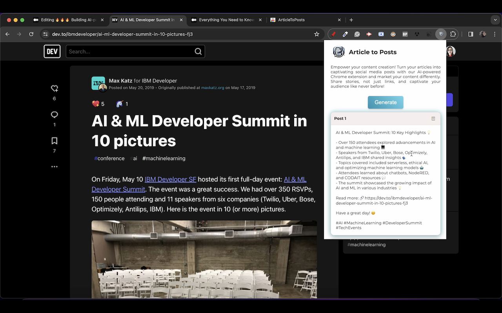

# ArticleToPosts Extension Powered by AI 🚀

Welcome to the ArticleToPosts extension GitHub project! 🎉 This extension provides a seamless way to convert articles into engaging social media posts, saving you time and effort in content creation. With ArticleToPosts, you can effortlessly transform your written content into visually captivating posts for various social media platforms.

## Demo Video 📹

Check out this short demo video to see ArticleToPosts in action:

## Features 🌟

- Convert articles into social media posts in few seconds and with ease
- Automatically generate suitable emojis for each post
- Automatically generate hashtags based on the article's content
- Friendly output format for social media platforms
- Intuitive user interface for a seamless user experience

## Screenshots 🖼️

Here are some screenshots showcasing the user interface and features of ArticleToPosts:

## Get Started 🚀

Get ArticleToPosts by going to the Google Web Store, searching for it in the search bar, and adding it to Chrome for installation.. Once set up, you'll be ready to start converting articles into engaging social media posts in no time!

## Read more about the build process step by step 📖

This [article](https://example.com/article) provides detailed information about the tools I used to build the extension, the UI, the extension brain, and its initial cost.

## Support 🗣️

Have you tried ArticleToPosts? Share your feedback on the Google Web Store and give a rate to the extension. We'd love to hear from you! 🗣️

## Contribution 🤝

Feel free to contribute to the project by opening an issue or submitting a pull request. Your contribution is valuable to us as we continue to improve and expand the functionality of ArticleToPosts. 

---

If you have any questions, feedback, or feature requests, feel free to [open an issue](https://github.com/famzila/article-to-posts/issues) or [submit a pull request](https://github.com/famzila/article-to-posts/pulls). Happy posting! 😊

---

🌟 Made with love by [Fatima AMZIL](https://github.com/famzila) 🌟
